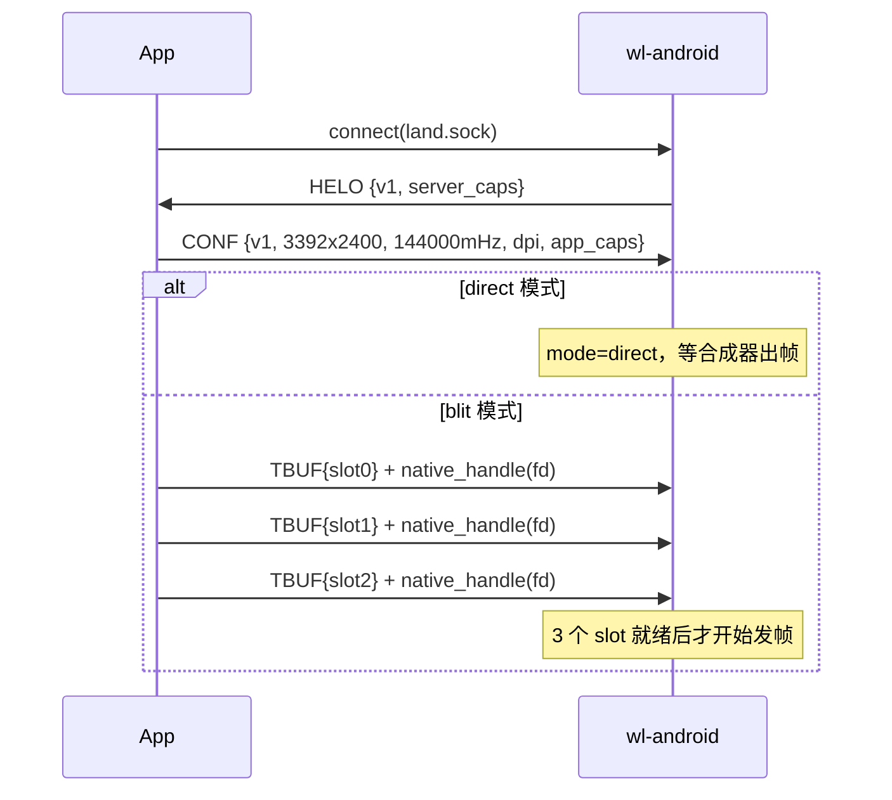
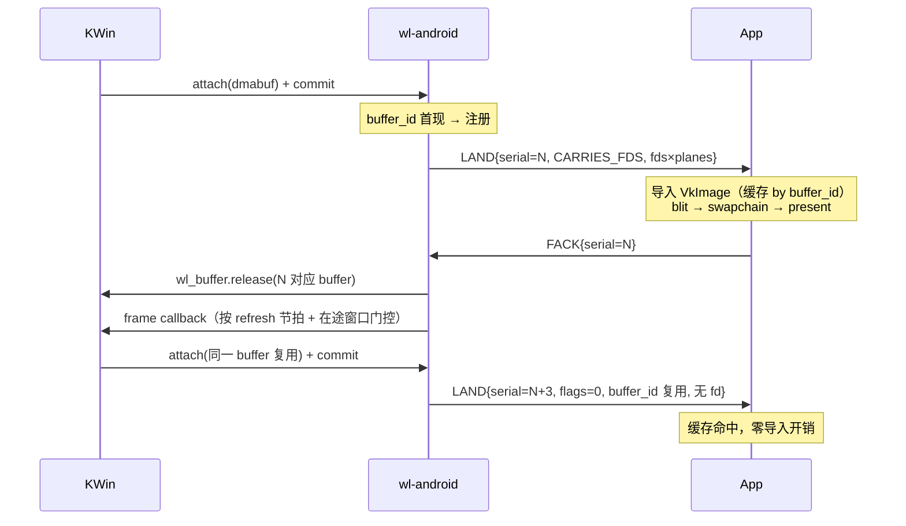
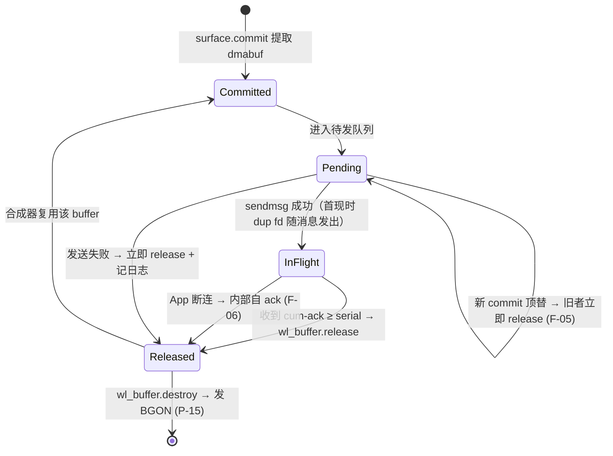
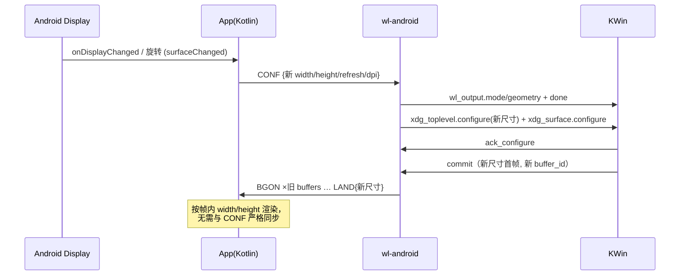
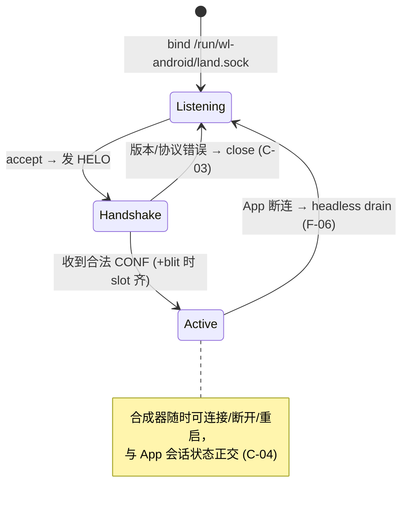

# DESIGN.md — wl-android 详细设计

> 状态：v1 冻结稿。协议与状态机的任何修改必须先改本文件（含规则编号），再改代码。
> 规则编号约定：`P-xx` 协议、`H-xx` 握手、`F-xx` fd/buffer 生命周期、`C-xx` 连接、
> `T-xx` 触摸、`O-xx` 输出/动态配置、`X-xx` 可测性、`V-xx` 真机验收。测试用例必须在名称或注释中
> 引用其验证的规则编号。

---

## 1. 架构总览

```
┌── Droidspaces 容器 ─────────────────────────────────────────┐
│  KWin (startplasma-wayland, WAYLAND_DISPLAY=land-0)         │
│    │ 标准 Wayland 协议 (xdg_shell / dmabuf v4 / seat / ...) │
│    ▼                                                        │
│  wl-android  ← Smithay 实现的最小合成器 (透明中间层)          │
│    │ land.sock: 二进制协议 + SCM_RIGHTS                     │
└────┼────────────────────────────────────────────────────────┘
     │ Droidspaces bind mount:
     │   宿主 /data/local/tmp/wl-android/ ⇔ 容器 /run/wl-android/
┌────┼────────────────────────────────────────────────────────┐
│    ▼                                                        │
│  wl-android-app (Kotlin UI + Rust JNI)                      │
│    dmabuf 导入(直接模式) 或 AHB 池(blit 模式) → Vulkan →     │
│    SurfaceView；MotionEvent → TouchMessage；                 │
│    DisplayListener → ConfigMessage                          │
│  Magisk 模块: 目录 + sepolicy（仅配置，无逻辑）              │
└── Android 宿主机 (一加平板 3, 8 Elite) ──────────────────────┘
```

角色约定：**wl-android 是 land.sock 的 listener**（容器内 root 绑定
`/run/wl-android/land.sock`）；**App 是 connector**。

---

## 2. 术语

| 术语 | 含义 |
|------|------|
| 合成器 | 连接到 land-0 的 Wayland 客户端（KWin 等，嵌套模式） |
| 会话 (session) | App 与 wl-android 之间一次成功握手后的连接期 |
| 直接模式 (direct) | KWin 的 dmabuf fd 原样转发给 App，App 用 Vulkan 直接导入 |
| blit 模式 | App 预注册 AHB slot 池，wl-android 用 Vulkan 将 KWin 帧 blit 进 slot |
| buffer_id | 服务端为每个可复用缓冲区分配的稳定标识（避免每帧重复导入） |
| serial | 单调递增的帧序号，跨会话不重置 |

---

## 3. 传输层

- **P-01** 传输为 `AF_UNIX` + **`SOCK_SEQPACKET`**：内核保证消息边界，一条消息 = 一次
  `sendmsg`/`recvmsg`；fd 经 `SCM_RIGHTS` 随所属消息一并到达。
- **P-02** 所有多字节字段为**小端序**（两端均为 aarch64 LE；测试端 x86_64 亦 LE）。
- **P-03** 所有消息结构 `#[repr(C)]`、显式 padding、无隐式对齐洞；以 zerocopy
  `FromBytes/IntoBytes/Immutable/KnownLayout` derive 编解码，禁止手写 `transmute`。
- **P-04** magic 为消息类型判别符，wire 上为 ASCII 字节序列（如 `b"CONF"`），
  代码中常量定义为 `u32::from_le_bytes(*b"CONF")`。
- **P-05** 收到未知 magic / 长度不符的消息：记录日志并**断开连接**（协议错误不可恢复）。
- **P-06** 单会话内消息按 socket 顺序处理，无乱序语义。
- **P-07** 协议版本 v1 要求两端**严格相等**；不匹配即断开（见 H-03）。字段演进规则：
  只追加不重排、不改语义；新能力走 caps 位；不兼容改动必须升 version。

## 4. 消息定义（wire format v1）

消息一览：

| magic | 名称 | 方向 | 伴随 fd | 大小 |
|-------|------|------|---------|------|
| `HELO` | Hello | server → App | 无 | 16 B |
| `CONF` | Config | App → server | 无 | 32 B |
| `LAND` | Frame | server → App | 首现时 num_planes 个 | 80 B |
| `FACK` | FrameAck | App → server | 无 | 16 B |
| `TBUF` | SlotBuffer | App → server | 无（fd 走后续 native_handle 流，见 P-13） | 64 B |
| `BGON` | BufferGone | server → App | 无 | 16 B |
| `TOUC` | Touch | App → server | 无 | 24 B |

### 4.1 Hello（server → App，连接建立后服务端首发）

| 偏移 | 字段 | 类型 | 说明 |
|------|------|------|------|
| 0 | magic | u32 | `b"HELO"` |
| 4 | protocol_version | u32 | = 1 |
| 8 | server_caps | u32 | bit0 `SERVER_CAP_BLIT`：blit fallback 可用 |
| 12 | _reserved | u32 | = 0 |

### 4.2 Config（App → server，握手时 + 屏幕变化时）

| 偏移 | 字段 | 类型 | 说明 |
|------|------|------|------|
| 0 | magic | u32 | `b"CONF"` |
| 4 | protocol_version | u32 | = 1 |
| 8 | width | u32 | 像素，App 渲染 surface 实际尺寸 |
| 12 | height | u32 | 像素 |
| 16 | refresh_millihz | u32 | 毫赫兹（与 `wl_output.mode` 单位一致），如 144000 |
| 20 | dpi | u32 | `densityDpi` |
| 24 | app_caps | u32 | bit0 `APP_CAP_DIRECT_IMPORT`：宿主驱动支持 dmabuf 直接导入 |
| 28 | _reserved | u32 | = 0 |

### 4.3 Frame（server → App）

| 偏移 | 字段 | 类型 | 说明 |
|------|------|------|------|
| 0 | magic | u32 | `b"LAND"` |
| 4 | num_planes | u32 | 1..4，恒描述完整布局 |
| 8 | serial | u64 | 单调递增 |
| 16 | modifier | u64 | v1 恒为 `DRM_FORMAT_MOD_LINEAR` (0) |
| 24 | width | u32 | |
| 28 | height | u32 | |
| 32 | drm_format | u32 | `DRM_FORMAT_*` fourcc |
| 36 | flags | u32 | bit0 `FRAME_CARRIES_FDS`：本消息伴随 num_planes 个 fd（该 buffer_id 首次出现） |
| 40 | buffer_id | u32 | 稳定缓冲区标识；blit 模式 = slot 号 |
| 44 | _reserved | u32 | = 0 |
| 48 | planes[4] | {offset u32, stride u32} ×4 | 未用平面填 0 |

- **P-08** `FRAME_CARRIES_FDS` 置位 ⇔ 消息伴随恰好 `num_planes` 个 fd（按平面序）。
- **P-09** 同一 buffer_id 的复用帧（flags=0）其几何/格式/布局字段必须与注册时一致，
  App 校验不一致即视为协议错误（P-05）。
- **P-10** 新会话开始时服务端清空"已注册"状态：所有 buffer_id 在该会话首现时必带 fd。

### 4.4 FrameAck（App → server）

| 偏移 | 字段 | 类型 | 说明 |
|------|------|------|------|
| 0 | magic | u32 | `b"FACK"` |
| 4 | _reserved | u32 | = 0 |
| 8 | serial | u64 | **累积确认**：ack 所有 serial ≤ 该值的帧 |

- **P-11** App 对收到的每一帧都必须最终 ack（即便丢弃未显示）；ack 语义为累积（cum-ack）。

### 4.5 SlotBuffer（App → server，仅 blit 模式，slot 注册）

| 偏移 | 字段 | 类型 | 说明 |
|------|------|------|------|
| 0 | magic | u32 | `b"TBUF"` |
| 4 | slot | u32 | 0..SLOT_COUNT-1 |
| 8 | modifier | u64 | v1 恒 LINEAR |
| 16 | width | u32 | |
| 20 | height | u32 | |
| 24 | drm_format | u32 | v1 恒 `DRM_FORMAT_ABGR8888`（对应 AHB `R8G8B8A8_UNORM`） |
| 28 | num_planes | u32 | v1 恒 1 |
| 32 | planes[4] | 同 Frame | stride 为**字节**（由 AHB describe 的像素 stride 换算） |

- **P-12** `SLOT_COUNT = 3`（三缓冲）。
- **P-13** 每条 TBUF 之后，App 立即在同一 socket 上调用
  `AHardwareBuffer_sendHandleToUnixSocket()`，产生**恰好一条**后续消息（native_handle
  线格式 + SCM_RIGHTS fd）。服务端由 `ahb_handle` 模块（GZ-001）解析提取 dmabuf fd。
  解析失败 → 明确报错并断开，doctor 可复现诊断。
- **P-14** 分辨率变化后 slot 池整体作废：App 重新分配 AHB 并重发全部 TBUF；服务端
  收到新 TBUF 时关闭旧 slot fd。

### 4.6 BufferGone（server → App，仅直接模式）

| 偏移 | 字段 | 类型 | 说明 |
|------|------|------|------|
| 0 | magic | u32 | `b"BGON"` |
| 4 | buffer_id | u32 | 该缓冲区已被合成器销毁 |
| 8 | _reserved | u64 | = 0 |

- **P-15** App 收到后在最后一次使用完成时销毁对应 VkImage/VkDeviceMemory 并 close fd。

### 4.7 Touch（App → server）

| 偏移 | 字段 | 类型 | 说明 |
|------|------|------|------|
| 0 | magic | u32 | `b"TOUC"` |
| 4 | touch_id | i32 | `MotionEvent` pointerId |
| 8 | x | f32 | 归一化 [0,1]，相对 App 渲染 surface |
| 12 | y | f32 | 归一化 [0,1] |
| 16 | phase | u32 | 0=DOWN 1=MOVE 2=UP 3=CANCEL 4=FRAME |
| 20 | time_ms | u32 | `MotionEvent.eventTime` 低 32 位（延迟测量用） |

- **T-01** 服务端将归一化坐标映射到当前输出逻辑尺寸后注入 `wl_touch`。
- **T-02** `phase=FRAME` 表示一组多点事件结束，服务端发出 `wl_touch.frame`；
  FRAME 消息的 touch_id/x/y 字段被忽略。App 在处理完一个 `MotionEvent` 的全部
  pointer 后必须发送 FRAME。
- **T-03** CANCEL 注入 `wl_touch.cancel`。

---

## 5. 握手与模式选择

- **H-01** 连接建立后服务端立即发送 Hello；App 校验 protocol_version。
- **H-02** App 回复 Config（首条必须是 Config，否则 P-05 断开）。
- **H-03** 版本不匹配：App 侧展示明确错误并断开；服务端收到版本不匹配的 Config
  也断开并记日志。
- **H-04** 模式选择（服务端执行，会话期内不变）：
  1. `app_caps.DIRECT_IMPORT` 置位 → **direct**；
  2. 否则 `server_caps.BLIT` 置位 → **blit**（等待 SLOT_COUNT 条 TBUF 后才开始发帧）；
  3. 否则：记日志、断开。App 显示"无可用帧路径"。
  调试覆盖：环境变量 `LAND_MODE=direct|blit` 可强制（默认 `auto`）。
- **H-05** 会话中途收到新 Config：仅更新输出参数（第 7 节），不重新选择模式。



---

## 6. 帧循环与 buffer/fd 生命周期

### 6.1 稳态帧循环（direct 模式）



### 6.2 buffer 生命周期状态机（direct 模式，per wl_buffer）



fd 所有权规则：

- **F-01** 服务端从 Smithay 获得的 dmabuf fd 由服务端持有；`sendmsg` 的 SCM_RIGHTS
  语义是内核侧 dup，**发送不转移所有权**——服务端在会话内保留自己的 fd 直到该
  wl_buffer destroy（届时 close + 发 BGON）。
- **F-02** App 收到的 fd 由 App 持有：Vulkan `vkAllocateMemory` dma_buf import 成功
  即转移给驱动（不得再 close）；导入失败路径必须显式 close。
- **F-03** 每一条错误路径（发送失败 / 解析失败 / 断连 / 导入失败）都必须有确定的
  fd 归属与 close 责任，测试以 fd 计数断言覆盖（X-04）。
- **F-04** 在途窗口 `MAX_IN_FLIGHT = 2`：unacked 帧达到上限时，扣发 frame callback，
  以 Wayland 标准节流机制反压 KWin。
- **F-05** Pending 位仅 1 帧，**latest-wins**：新 commit 顶替未发送的旧帧，旧帧
  buffer 立即 release（从未发出，无 fd 泄漏面）。
- **F-06** App 断连 / 无会话期间进入 **headless drain**：按 refresh 节拍内部自 ack
  （release + frame callback 照常），KWin 无感知、不冻结；帧内容丢弃、fd 不发送。
- **F-07** serial 跨会话单调递增，不重置（日志对齐与丢帧统计依赖此性质）。

### 6.3 blit 模式差异

- **F-08** 服务端持有 slot 池（App 注册的 AHB dmabuf 导入为 VkImage 常驻）；
  每帧：导入 KWin buffer（同样按 buffer_id 缓存）→ `vkCmdBlitImage` 到空闲 slot →
  fence 完成后发 `LAND{buffer_id=slot, flags=0}`（slot 的 fd 在 TBUF 时已给过 App
  ——本来就是 App 自己的 AHB，App 侧用 AHB 导入路径渲染，无需 fd）。
- **F-09** slot 空闲判定：该 slot 上一帧已被 cum-ack。无空闲 slot → 等同 F-04 反压。
- **F-10** KWin 侧 buffer 的 release 时机：blit 的 Vulkan fence signaled 即 release
  （不等 App ack——App ack 只管 slot 归还）。

### 6.4 帧节拍

- **O-01** frame callback 的目标节拍 = Config.refresh_millihz；由注入时钟驱动
  （测试可控，X-02）。callback 发放条件：到达节拍点 **且** 在途 < MAX_IN_FLIGHT
  **且**（blit 模式下）存在空闲 slot。

---

## 7. 动态配置（旋转 / 分辨率 / 刷新率）



- **O-02** 尺寸变化通过 **`xdg_toplevel.configure` 驱动**（嵌套合成器跟随窗口尺寸），
  `wl_output` 同步更新 mode/geometry/scale 并以 `done` 结束（原子性）。
- **O-03** 刷新率变化只更新 `wl_output.mode` 与内部节拍（O-01），不触发 configure。
- **O-04** 过渡期以 Frame 消息自带的 width/height 为准（自描述），App 不假设
  当前帧尺寸等于最近一次 CONF——杜绝旋转竞态。
- **O-05** 尺寸变化在 blit 模式下触发 P-14 slot 池重建；重建完成前 headless drain。
- **O-06** DPI → `wl_output` physical size 换算：`mm = px * 25.4 / dpi`。

---

## 8. 连接状态机（服务端视角）



- **C-01** 单会话制：同一时刻至多一个 App 连接；新连接到来时**替换**旧会话
  （旧连接 close，新连接走完整握手）。
- **C-02** 断连清理清单（原子执行）：在途帧全部内部自 ack；直接模式清空已注册
  buffer_id 集合（P-10）；blit 模式关闭全部 slot fd 并销毁对应 VkImage。
- **C-03** 协议错误（P-05/H-03）只断开当前会话，服务端进程不退出。
- **C-04** 合成器生命周期与 App 会话正交：合成器断开 → 停止发帧（App 侧超时显示
  "等待合成器"）；合成器重连 → 恢复。合成器可先于或后于 App 启动，顺序无关。
- **C-05** App 侧重连策略：断连后指数退避重连（250ms 起，上限 5s），成功后完整
  重新握手（含 caps 重探测、blit slot 重注册）。

---

## 9. 格式映射（v1）

### 9.1 dmabuf feedback 格式表

feedback 向客户端广播支持的 `DRM_FORMAT × modifier` 组合。v1 包含两种 modifier：
**LINEAR**（通用兼容）和 **QCOM_COMPRESSED**（UBWC，blit 路径高效路径）。

| DRM fourcc | modifier | 模式 | 用途 |
|------------|----------|------|------|
| `XRGB8888` | LINEAR | direct + blit | KWin 常用，swizzle=BGRX |
| `XRGB8888` | QCOM_COMPRESSED | blit only | UBWC 压缩输出（turnip 原生支持） |
| `ARGB8888` | LINEAR | direct + blit | swizzle=BGRA |
| `ARGB8888` | QCOM_COMPRESSED | blit only | |
| `XBGR8888` | LINEAR | direct + blit | swizzle=RGBX |
| `XBGR8888` | QCOM_COMPRESSED | blit only | |
| `ABGR8888` | LINEAR | direct + blit | swizzle=RGBA；blit slot 固定格式 |
| `ABGR8888` | QCOM_COMPRESSED | blit only | KGSL a830 原生 UBWC |

- **P-16** feedback 格式表 = 上表全部八项。服务端在 **direct 模式**下降级为
  仅 LINEAR 行（专有驱动不接受 QCOM_COMPRESSED）；**blit 模式**下全表广播，
  KWin/turnip 可输出 UBWC 压缩帧，blit 管线内 turnip 透明处理压缩格式。
- **P-17** modifier 常量：`DRM_FORMAT_MOD_LINEAR = 0`，`DRM_FORMAT_MOD_QCOM_COMPRESSED = 0x0800000000000005`。

### 9.2 Vulkan 格式映射（App 侧导入）

| DRM fourcc | 内存字节序 (LE) | Vulkan format | 说明 |
|------------|----------------|---------------|------|
| `XRGB8888` | B,G,R,X | `VK_FORMAT_B8G8R8A8_UNORM` | 忽略 alpha 分量 |
| `ARGB8888` | B,G,R,A | `VK_FORMAT_B8G8R8A8_UNORM` | |
| `XBGR8888` | R,G,B,X | `VK_FORMAT_R8G8B8A8_UNORM` | 忽略 alpha 分量 |
| `ABGR8888` | R,G,B,A | `VK_FORMAT_R8G8B8A8_UNORM` | blit slot 固定格式 |

### 9.3 模式与 modifier 策略

| 模式 | KWin 输出 modifier | App 侧 modifier | Blit 源 modifier | Blit 目标 modifier |
|------|-------------------|-----------------|-----------------|-------------------|
| **direct** | LINEAR（feedback 限制） | LINEAR | — | — |
| **blit** | QCOM_COMPRESSED（turnip 原生） | —（不导入 KWin 帧） | QCOM_COMPRESSED | QCOM_COMPRESSED（AHB via gralloc） |

关键点：blit 路径下整个管线（KWin 输出 → turnip 导入源 → blit → turnip 写到 AHB target）
均在**同一 turnip Vulkan instance 内完成**，KGSL 内核层统一处理 UBWC 布局。
不存在跨驱动 modifier 互通问题。

---

## 10. 模块与公开 API 概要

### 10.1 crates/wl-android-common

```rust
pub mod proto {
    // 全部消息 struct（zerocopy derive）、magic/caps/flags 常量、
    pub enum Message { Hello(..), Config(..), Frame(..), Ack(..), Slot(..), Gone(..), Touch(..) }
    pub fn encode(&Message) -> (Vec<u8>, Vec<BorrowedFd>);
    pub fn decode(bytes: &[u8], fds: Vec<OwnedFd>) -> Result<Message, ProtoError>;
}
pub mod transport {
    /// SEQPACKET + SCM_RIGHTS 的唯一 syscall 封装点（X-01 注入点）
    pub trait Transport { fn send(&mut self, msg: &Message) -> io::Result<()>;
                          fn recv(&mut self) -> io::Result<Option<Message>>; }
    pub struct UnixSeqpacket(..);   // 生产实现
}
pub mod testutil {   // 仅 cfg(test)/dev-dependency 暴露
    pub fn memfd_fake_dmabuf(len: usize) -> OwnedFd;   // fd 替身
    pub struct FdCountGuard;        // Drop 时断言 /proc/self/fd 计数不变
    pub struct MockClock;           // 手动推进的注入时钟
}
```

### 10.2 crates/wl-android（服务端）

| 模块 | 职责 | 关键类型 |
|------|------|----------|
| `main.rs` | CLI（`run` / `doctor`）、calloop 装配 | — |
| `state.rs` | 全局状态：Smithay handlers 聚合 | `ServerState` |
| `comp/` | Smithay delegate：compositor/shm/xdg/dmabuf(v4 feedback, LINEAR + QCOM_COMPRESSED 表)/seat/output | — |
| `frame_router.rs` | §6 状态机全部逻辑（**纯逻辑，不碰 syscall**） | `FrameRouter`, `RouterEvent`, `RouterAction` |
| `app_link.rs` | §8 会话状态机 + Transport 驱动 | `AppLink` |
| `blit.rs` | ash Vulkan blit 管线（导入/blit/fence） | `BlitEngine` |
| `ahb_handle.rs` | **GZ-001 唯一所在**：native_handle 线格式解析 | `parse_native_handle(bytes, fds) -> Result<Vec<OwnedFd>>` |
| `touch.rs` | TouchMessage → wl_touch 注入（T-01..03） | — |
| `output_mgr.rs` | O-01..O-06 | — |
| `doctor.rs` | 自检：socket/权限/vulkan/fd 往返/GZ-001 解析 | — |

`FrameRouter` 设计为**事件进/动作出**的纯状态机：
`fn handle(&mut self, ev: RouterEvent) -> Vec<RouterAction>`，事件含
`Commit{buffer}/Ack{serial}/AppConnected/AppLost/Tick`，动作含
`SendFrame/Release{buffer}/FireCallback/CloseFd/SendGone`——TDD 主战场。

### 10.3 android-app

Kotlin ↔ JNI 边界（全部经 `NativeBridge` 单类）：

| JNI 函数 | 语义 |
|----------|------|
| `nativeInit(socketPath: String): Long` | 建立运行时，返回句柄 |
| `nativeSetSurface(h: Long, surface: Surface?)` | ANativeWindow 生命周期（null=销毁） |
| `nativeOnConfig(h, w, h, refreshMillihz, dpi)` | 触发 CONF 发送 |
| `nativeOnTouch(h, id, x, y, phase, timeMs)` | 触摸入队（无锁 ring buffer） |
| `nativeGetState(h): Int` | 状态轮询：连接/握手/活跃/等待合成器/错误码 |
| `nativeDestroy(h)` | 全量清理 |

Kotlin 侧：`MainActivity`（薄壳）/ `ScreenInfoCollector`（DisplayListener +
surfaceChanged 去抖后调 `nativeOnConfig`）/ `TouchForwarder`（MotionEvent 展开为
per-pointer TOUC + FRAME，T-02）。

---

## 11. 可测性架构

- **X-01** 全部 syscall 经注入点：`Transport`（socket）、`Clock`（节拍）、fd 来源
  （测试用 memfd 替身——fd 传递语义与内容无关）。核心状态机（`FrameRouter`、
  `AppLink`、编解码）为纯逻辑，可在任意开发机 `cargo test`。
- **X-02** `MockClock` 手动推进验证 O-01 门控（节拍 × 在途窗口 × slot 空闲的组合）。
- **X-03** **golden bytes**：每种消息的编码字节快照（insta）提交入库；proptest
  做 roundtrip（decode(encode(m)) == m）与畸形输入不 panic。
- **X-04** 所有集成测试包裹 `FdCountGuard`，前后 `/proc/self/fd` 计数必须相等
  ——"fd 泄漏零容忍"的机械化执行。
- **X-05** **FakeCompositor**（`wayland-client` 实现的无头客户端）：连接 land-0 →
  绑定全局 → 建 surface/xdg_toplevel → attach(memfd 假 dmabuf 或 wl_shm) → commit，
  可断言收到 configure/frame callback/release。覆盖服务端 Wayland 行为全路径。
- **X-06** **mock-app**：Transport 对端模拟 App 完整行为（握手/收帧/ack/touch/断连
  重连/slot 注册），与真实服务端进程走真 socket 跑集成回归。
- **X-07** 真机不可测部分（Vulkan 导入、turnip、SELinux）收窄为薄壳；真机探明的
  事实（扩展列表、格式支持）以常量+断言固化进 doctor，防环境回归。
- **X-08** 每个里程碑的验收测试**先于实现**编写（红→绿→重构）；测试引用规则编号。

---

## 12. 环境变量

| 变量 | 默认值 | 说明 |
|------|--------|------|
| `WAYLAND_DISPLAY` | `land-0` | 服务端绑定 `$XDG_RUNTIME_DIR/$WAYLAND_DISPLAY`；合成器以同名连接 |
| `XDG_RUNTIME_DIR` | （必须已设置） | 未设置时警告并回退 `/tmp` |
| `LAND_SOCKET` | `/run/wl-android/land.sock` | App 通信 socket（listener 侧路径） |
| `LAND_MODE` | `auto` | `auto\|direct\|blit`，调试强制帧路径（H-04） |
| `LAND_LOG` | `info` | `error\|info\|debug\|proto`（proto 含逐消息 serial 级 dump） |

---

## 13. 决策记录（ADR 摘要）

| # | 决策 | 理由 |
|---|------|------|
| 1 | 容器侧 listen + bind mount，App 是 connector | Unix socket 无法由 Magisk `touch` 预创建；容器 root bind 最简且 sepolicy 面最小 |
| 2 | Smithay 而非裸 wayland-server | dmabuf v4 feedback / xdg-shell / seat 现成实现；库使用不违反边界 |
| 3 | 协议集含 xdg_wm_base/wl_shm/wl_subcompositor | 嵌套 KWin 是 xdg_toplevel 客户端；wl_shm 为事实强制 |
| 4 | SOCK_SEQPACKET | 消息边界由内核维护，无需手写流式分帧 |
| 5 | ~~v1 强制 LINEAR modifier~~（已废除，见 #15） | ~~a830 新版 UBWC 布局互通风险~~；M0 确认 Adreno 830 仅 blit 路径可用，blit 管线全在 turnip 内，UBWC 互通无风险 |
| 6 | direct + blit 双路径，运行时协商 | 宿主专有驱动 dma_buf 导入支持未知；AHB 路径 CDD 保证兜底 |
| 7 | buffer_id 注册 + fd 只发一次 | 消除每帧 Vulkan 导入开销（稳态零导入） |
| 8 | cum-ack + MAX_IN_FLIGHT=2 + latest-wins | 最小化延迟同时以标准 frame callback 节流反压 |
| 9 | headless drain 自 ack | App 断连/未启动时 KWin 不冻结（用户先启动容器侧也能工作） |
| 10 | serial 跨会话不重置 | 两端日志按 serial 对齐排障 |
| 11 | zerocopy + golden bytes + 单一协议 crate | 两端同源编译，跨端漂移在编译期/CI 期消除 |
| 12 | JNI 纯 Rust cdylib（无 bridge.cpp/CMake） | jni crate 直接导出符号，少一层维护面 |
| 13 | 触摸坐标归一化 [0,1] | 旋转过渡期与分辨率解耦（配合 O-04） |
| 14 | v1 仅触摸输入 | 键鼠留 v2（协议按 P-07 追加 KeyMessage/PointerMessage 即可） |
| 15 | blit 路径启用 UBWC (QCOM_COMPRESSED) | M0 确认 Adreno 830 专有驱动不支持 `VK_EXT_external_memory_dma_buf`（direct 不可用）；blit 管线全在 turnip 同一 Vulkan instance 内，KGSL 内核层统一处理 UBWC 布局，无跨驱动 modifier 互通风险；3392×2400 分辨率下 UBWC 省带宽 ~50% |

---

## 14. 验收规则（V-xx）

每个里程碑的真机验收项以 `V-xx` 编号，对应 `milestones/M{x}-verify.sh` 脚本中的检查点。
CI 层可测的部分由 X-xx 规则覆盖；V-xx 专指需要真机环境（设备/容器/触摸/旋转）的验收。

### M2：Smithay 服务端骨架

| 编号 | 验收项 | 方法 |
|------|--------|------|
| V-01 | wl-android 启动，land-0 协议对象完整 | `weston-info` 枚举 compositor/shm/xdg/dmabuf/seat/output/subcompositor |
| V-02 | doctor 自检通过 | `wl-android doctor` 输出无 ERROR，socket 权限正常 |
| V-03 | FakeCompositor 帧到达 mock-app | CI `cargo test mock_app_roundtrip`（X-05/X-06） |
| V-04 | 进程稳定 | 启动后 30s 无 crash / SIGSEGV |

### M3：App 渲染

| 编号 | 验收项 | 方法 |
|------|--------|------|
| V-05 | App 连接 land.sock | App 调试页显示 State=Active, protocol_version=1, mode=blit |
| V-06 | blit slot 池注册 | 3/3 TBUF 消息完成，slot fd 已发至容器 |
| V-07 | 帧循环稳定 | Frame serial 递增、Ack 匹配、无 buffer 冻结（容器 log 无 "pool exhausted"） |
| V-08 | 视觉输出正确 | `weston-simple-dmabuf-egl` 测试 pattern 渲染正确，颜色无花屏 |

### M4：触摸注入

| 编号 | 验收项 | 方法 |
|------|--------|------|
| V-09 | 单点触摸 | `weston-simple-touch` 窗口内 tap → 点出现在触摸位置 |
| V-10 | 拖拽 | touch + drag → 点跟随手指 |
| V-11 | 多点触控 | 双指同时触控 → 两个 touch_id 独立跟踪 |
| V-12 | FRAME sentinel | T-02 规则：每组 pointer 后发 FRAME；CI 测试覆盖 |
| V-13 | 边缘情况 | 屏幕边缘坐标 (x≈0, x≈1)、快速连击、手掌误触 → 不 crash |

### M5：动态配置

| 编号 | 验收项 | 方法 |
|------|--------|------|
| V-14 | 屏幕旋转 | 旋转 90° → wl_output mode 更新、xdg_toplevel configure 新尺寸、桌面重排 |
| V-15 | 分辨率变化 | `adb shell wm size` 改分辨率 → App 发新 CONF → 桌面适配 → reset 恢复 |
| V-16 | 刷新率变化 | 切换 60↔144Hz → ConfigMessage.refresh_millihz 更新 → 帧节拍调整 |
| V-17 | 快速旋转无竞态 | O-04 规则：反复快速旋转 → 无画面撕裂、最终方向正确 |

### M6：KWin/Plasma 拉起

| 编号 | 验收项 | 方法 |
|------|--------|------|
| V-18 | KWin 连接 land-0 | `kwin_wayland` 无协议错误；xdg_toplevel + dmabuf 绑定成功 |
| V-19 | Plasma 桌面可见 | 面板/壁纸渲染正常、帧率稳定 |
| V-20 | Plasma 触摸交互 | 点击应用启动器、拖拽窗口、关闭窗口 |
| V-21 | 应用窗口 | 启动 GUI 应用（konsole/kwrite）→ 窗口可见、可交互、内容正确 |
| V-22 | 旋转 + Plasma | 旋转时面板重定位、窗口重排、无 crash |
| V-23 | 协议缺失扫描 | 容器 log 无 "unknown global" / "unsupported protocol" 警告 |

### M7：性能收口 + 兼容性

| 编号 | 验收项 | 方法 |
|------|--------|------|
| V-24 | 内存/fd 约束 | PERF-05 RSS < 32MB；PERF-07 fd 泄漏 = 0（1h soak 采样） |
| V-25 | doctor 全面报告 | 延迟 p95（PERF-02/03/04）、导入计数（PERF-11）、格式支持表 |
| V-26 | App 内存 | PERF-06 PSS < 128MB（`dumpsys meminfo`） |
| V-27 | Weston 嵌套 | `weston --backend=wayland-backend.so` + weston-simple-dmabuf-egl 通过 |
| V-28 | Hyprland 嵌套 | Hyprland 嵌套启动 + 基础渲染/触摸 |
| V-29 | 1h 连续运行 | FPS/内存/fd 稳定；两端无 ANR/crash |
